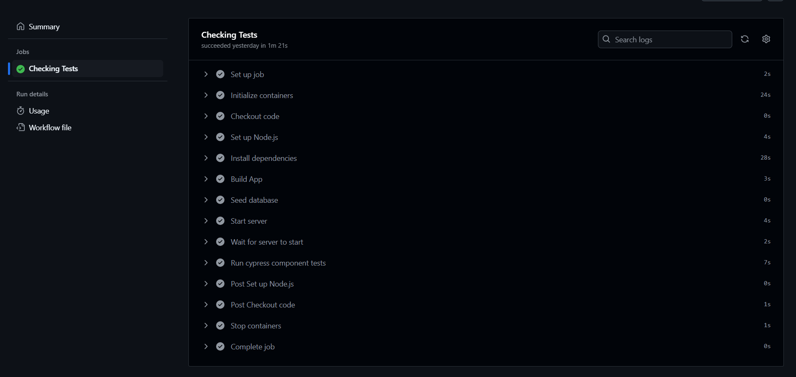
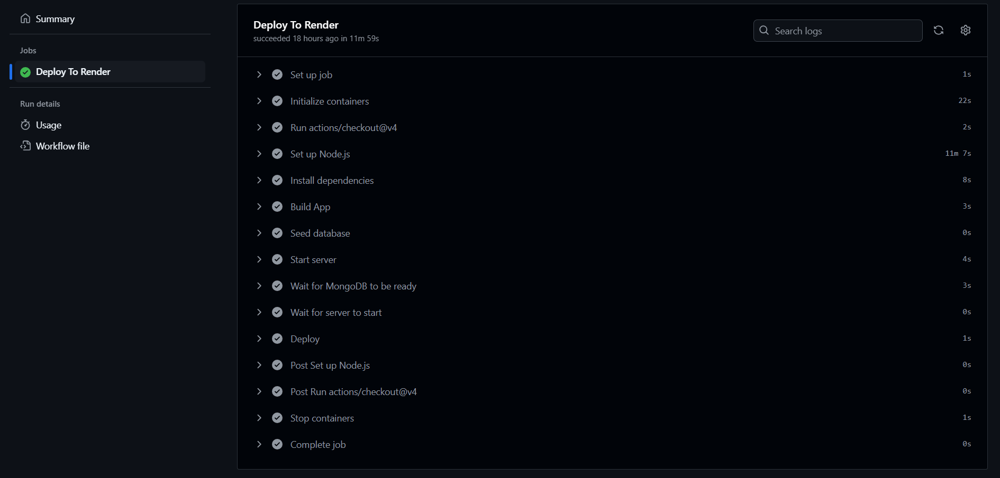

[](https://opensource.org/licenses/MIT)

# GitHub Actions CI/CD Setup

## Description

This project was driven by the need to streamline code quality checks and deployment for applications as they grow, using a CI/CD pipeline to support scalability, consistency, and efficiency. I built this project to automate the process of running Cypress component tests and deploying code seamlessly when merging feature branches, ensuring that only reliable code reaches production. The CI/CD pipeline solves the challenge of maintaining high code standards by automating testing for each Pull Request to the `develop` branch and deploying updates to the live site upon merging to `main`, reducing manual oversight. Through this project, I learned how to set up and manage GitHub Actions for continuous integration and deployment, configure YAML files for custom workflows, and utilize Render for automatic application deployment, reinforcing best practices in CI/CD.

Deployed Link: https://github-actions-ci-cd-setup-pv0x.onrender.com

## Table of Contents

- [Installation](#installation)
- [Usage](#usage)
- [License](#license)
- [Contributing](#contributing)
- [Questions](#questions)

## Installation

1. **Clone the repository**

   Start by cloning the repository to your local machine using the following command:

   ```bash
   git clone https://github.com/RoryDowse/github-actions-ci-cd-setup.git
   ```

2. **Navigate to the project directory**

   Move into the directory of the project:

   ```bash
   cd Develop
   ```

3. **Install dependencies**

   ```bash
   npm install
   ```

## Usage

1. **Configure Render for Deployment**

- Create a Static Site on Render:

  - Connect it to your GitHub repo.

  - Enter the Build Command.

  - Enter the publish directory, i.e. `dist`.

  - Add MongoDBenvironment variables.

  - Turn off automatic deploys.

2. **Configure Deploy Hook**

- Retrieve the deploy hook from Render and add it to the GitHub repo Secrets and Variables.

3. **Configure and Protect Branches**

- Create a `develop` branch from `main` and push it up.

- Create a feature/testing branch from `develop`, make a small change in the code, and push it up.

- Perform a pull request comparing `feature/testing` to `develop` to trigger the `Checking Test` action.

- Add "Add classic branch protection rule" to branches, select the relevant protections and actions to perform (see YAML 'name').

4. **Push to GitHub**

- Add, commit, and push the branch to GitHub.

5. **Create Pull Requests and Check Tests**

- Create a pull request comparing the branches to trigger the relevant action.




## License

This project is licensed under the MIT license.

## Contributing

### Collaborators

Special thanks to the following collaborators who contributed to this project:

- Joem Casusi
- James Harding

### Third-Party Assets

This project also makes use of the following third-party assets and libraries:

**Cypress**  
 A powerful testing framework used to write end-to-end tests.  
 Cypress: [Cypress](https://www.cypress.io/)

- **Render**  
  Platform for deploying and managing web applications.  
  Website: [Render](https://render.com)

- **GitHub Actions**  
  GitHub’s CI/CD platform used to automate workflows.  
  GitHub: [GitHub Actions](https://github.com/features/actions)

## Questions

Please visit my GitHub profile: https://github.com/RoryDowse.<br>
For additional questions, please contact me at: rorydowse@hotmail.com.
